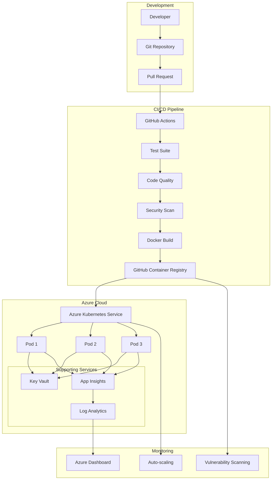
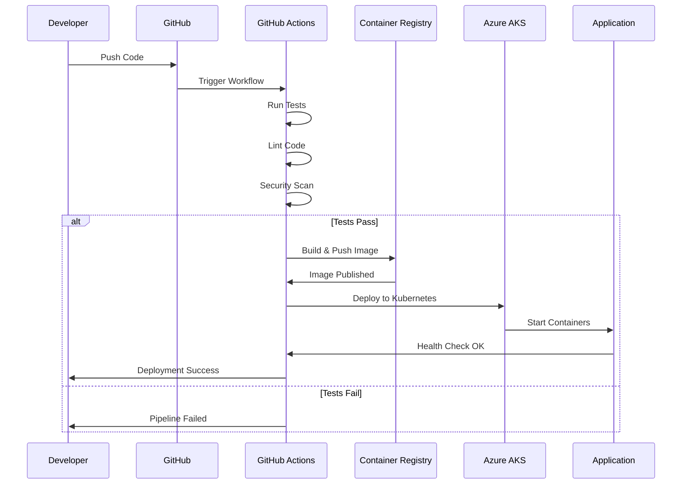
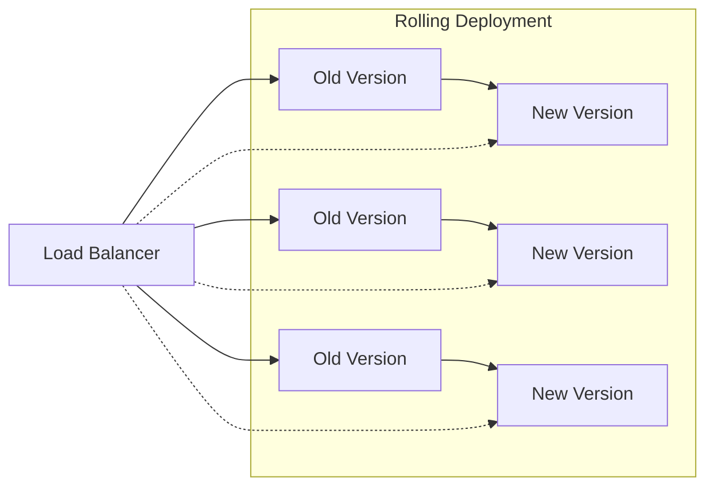
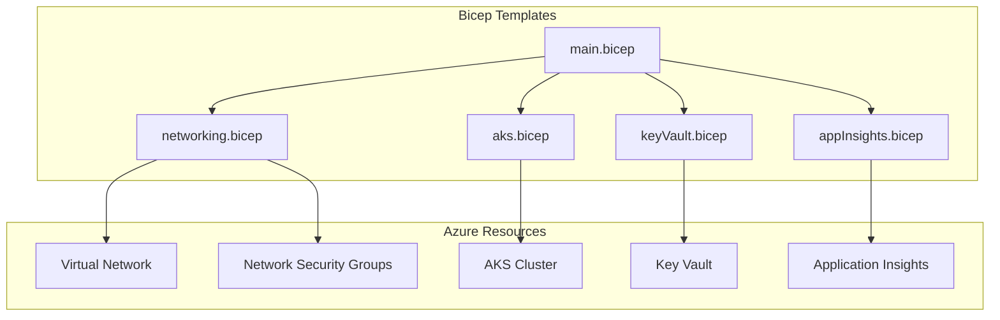
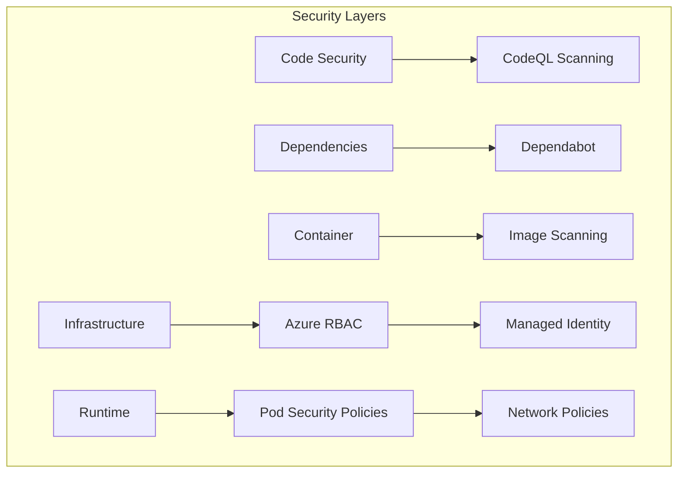
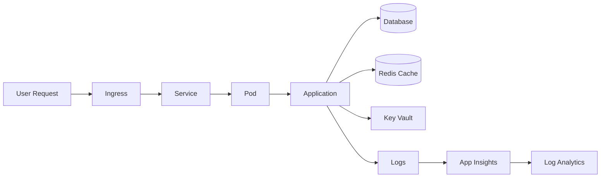
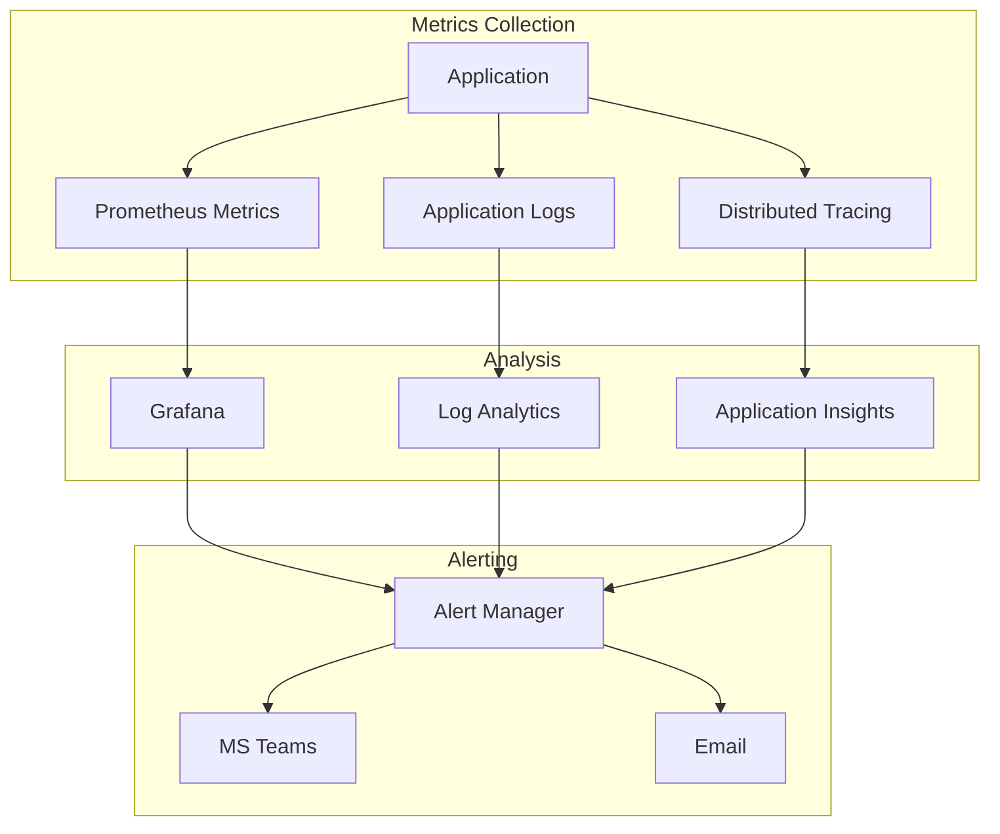
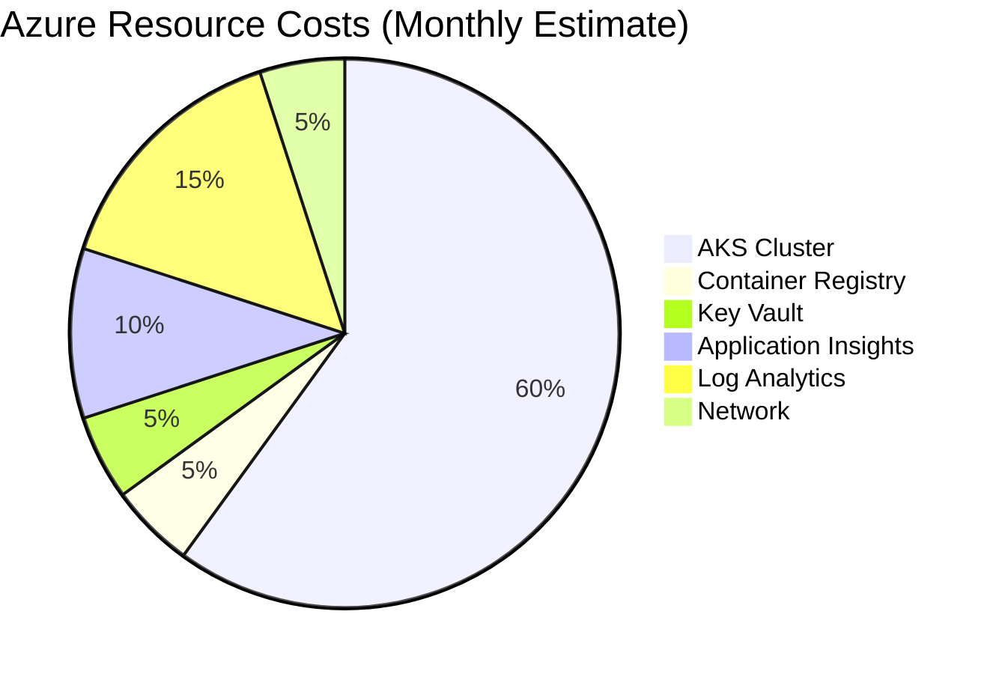
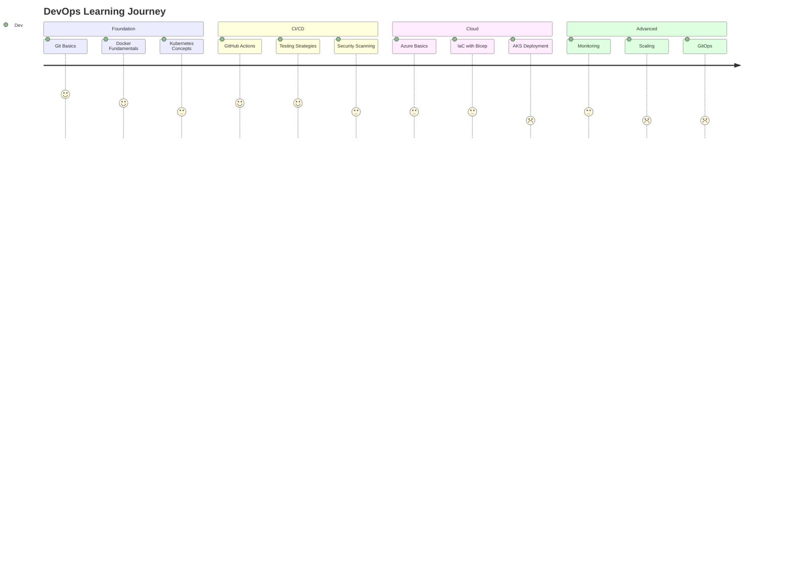

# DevOps E2E Architecture Documentation

## System Overview

This teaching repository demonstrates a complete DevOps pipeline from development to production deployment.

## Architecture Diagram

## CI/CD Flow

## Deployment Strategy

## Infrastructure as Code

## Security Architecture

## Data Flow

## Monitoring and Observability

## Cost Optimization

## Learning Path

## Technology Stack

| Layer | Technology | Purpose |
|-------|------------|---------|
| Application | Node.js/Express | Web Framework |
| Testing | Jest | Unit/Integration Tests |
| Containerization | Docker | Application Packaging |
| Registry | GitHub Packages | Container Storage |
| Orchestration | Kubernetes | Container Management |
| Cloud | Azure AKS | Managed Kubernetes |
| IaC | Bicep | Infrastructure Templates |
| CI/CD | GitHub Actions | Automation Pipeline |
| Security | CodeQL, Dependabot | Vulnerability Scanning |
| Monitoring | Application Insights | Observability |

## Key Decisions

1. **GitHub Packages over ACR**: Simpler authentication, free tier, integrated with GitHub
2. **Bicep over ARM/Terraform**: Native Azure tooling, better IntelliSense
3. **Managed Identity**: Passwordless authentication for Azure resources
4. **Multi-stage Docker builds**: Smaller production images
5. **GitHub Actions**: Native CI/CD, no additional tools needed

## Next Steps

- [ ] Implement Istio service mesh
- [ ] Add Prometheus/Grafana stack
- [ ] Implement GitOps with Flux/ArgoCD
- [ ] Add chaos engineering tests
- [ ] Implement blue-green deployments