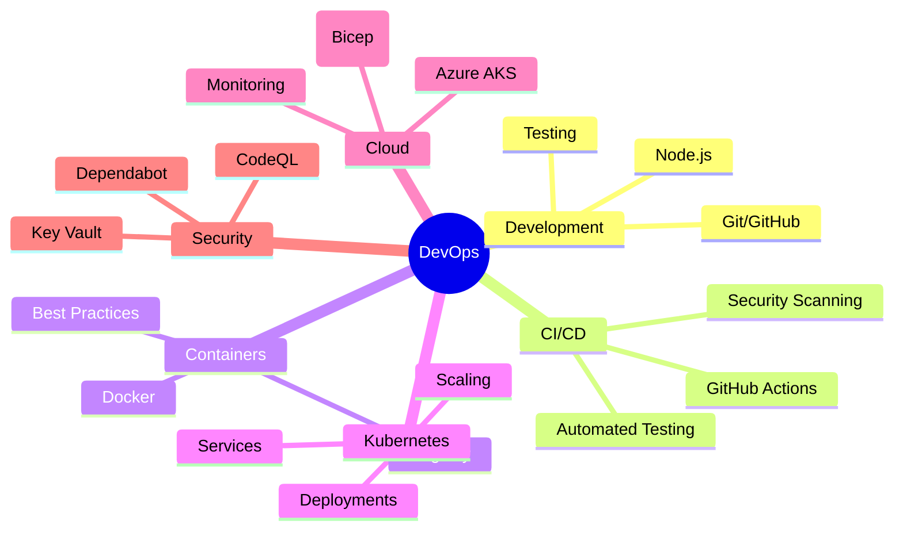

# Welcome to the DevOps E2E Teaching Wiki 🎓

## Quick Links
- [Getting Started](Getting-Started)
- [Architecture Overview](Architecture)
- [Learning Path](Learning-Path)
- [Lab Exercises](Lab-Exercises)
- [Troubleshooting](Troubleshooting)
- [FAQ](FAQ)

## What You'll Learn

This comprehensive DevOps teaching repository demonstrates real-world practices:



## Repository Structure

```
devops-e2e/
├── src/                 # Application source code
├── tests/              # Test suites
├── k8s/                # Kubernetes manifests
├── infrastructure/     # Bicep IaC templates
├── .github/           # GitHub Actions workflows
├── docs/              # Documentation
└── scripts/           # Utility scripts
```

## Course Timeline

| Week | Module | Focus Area |
|------|--------|------------|
| 1 | Foundation | Git, Environment Setup |
| 2 | Development | Node.js, Testing |
| 3 | Containers | Docker, Compose |
| 4 | CI/CD | GitHub Actions |
| 5 | Kubernetes | K8s Fundamentals |
| 6 | Cloud | Azure AKS, IaC |
| 7 | Security | Scanning, Secrets |
| 8 | Operations | Monitoring, Scaling |

## Getting Help

- 💬 [Discussions](https://github.com/timothywarner-org/devops-e2e/discussions)
- 🐛 [Issues](https://github.com/timothywarner-org/devops-e2e/issues)
- 📧 Email: instructor@devops-course.edu
- 🕐 Office Hours: Thursdays 2-3 PM EST

## Prerequisites

Before starting, ensure you have:
- [ ] GitHub account
- [ ] Git installed
- [ ] VS Code or preferred IDE
- [ ] Docker Desktop
- [ ] Node.js 18+
- [ ] Azure account (free tier)

## Success Metrics

Track your progress:
- 🟢 **Beginner**: Complete modules 1-3
- 🟡 **Intermediate**: Complete modules 4-6
- 🔴 **Advanced**: Complete all modules + project

## Contributing

We welcome contributions! See [Contributing Guide](Contributing) for details.

## License

This educational content is provided under MIT License.